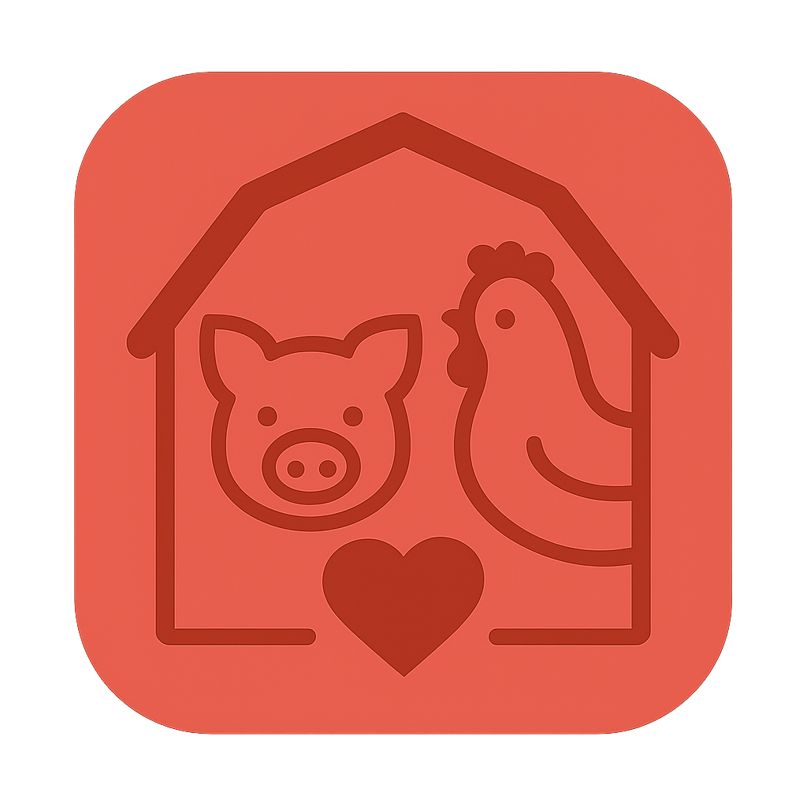

# 🐄 BIAN - Bienestar Animal

<p align="center">
  
</p>

<p align="center">
  <strong>Aplicación móvil para evaluación de bienestar animal en granjas</strong>
</p>

<p align="center">
  <a href="#-características">Características</a> •
  <a href="#-metodologías">Metodologías</a> •
  <a href="#-instalación">Instalación</a> •
  <a href="#-arquitectura">Arquitectura</a> •
  <a href="#-tecnologías">Tecnologías</a>
</p>

---

## 📋 Descripción

**BIAN** (Bienestar Animal) es una aplicación móvil desarrollada en Flutter que permite realizar evaluaciones de bienestar animal en granjas de manera sistemática y estandarizada. La app implementa metodologías oficiales del ICA (Instituto Colombiano Agropecuario) y protocolos internacionales de evaluación.

### 🎯 Objetivo

Facilitar la evaluación del bienestar animal en campo, generando reportes profesionales en PDF y permitiendo el seguimiento histórico de las evaluaciones realizadas.

---

## ✨ Características

### 📱 Funcionalidades Principales

| Característica | Descripción |
|----------------|-------------|
| **Evaluación Multi-especie** | Soporte para aves (pollos de engorde) y cerdos |
| **Modo Offline** | Funciona sin conexión, sincroniza cuando hay internet |
| **Geolocalización** | Captura automática de ubicación GPS con departamento y municipio |
| **Generación PDF** | Reportes profesionales con gráficos y tablas detalladas |
| **Multi-idioma** | Español e Inglés completo |
| **Roles de Usuario** | Evaluador y Administrador |

### 📊 Sistema de Evaluación

```
┌─────────────────────────────────────────────────────────────┐
│                    FLUJO DE EVALUACIÓN                       │
├─────────────────────────────────────────────────────────────┤
│  1. Selección de Especie (Aves / Cerdos)                    │
│  2. Información de Granja (nombre, ubicación, GPS)          │
│  3. Evaluación por Categorías                               │
│  4. Cálculo Automático de Puntuaciones                      │
│  5. Generación de Resultados y Recomendaciones              │
│  6. Exportación a PDF                                       │
│  7. Sincronización con Servidor                             │
└─────────────────────────────────────────────────────────────┘
```

---

## 📚 Metodologías

### 🐔 ICA - Aves (Pollos de Engorde)

Basada en la **Resolución 253 de 2020** del ICA y metodología oficial 2024.

| Categoría | Indicadores | Peso |
|-----------|-------------|------|
| Medidas Basadas en los Recursos | 11 | 35% |
| Indicadores del Animal | 10 | 35% |
| Indicadores de Gestión | 10 | 30% |
| **Total** | **31** | **100%** |

**Escala de Evaluación:** 0-2 puntos
- `0` = No cumple (Rojo)
- `1` = Cumple parcialmente (Naranja)
- `2` = Cumple (Verde)

### 🐷 EBA 3.0 - Cerdos

Protocolo **Estrategia Bienestar Animal 3.0** para evaluación integral de cerdos.

| Categoría | Indicadores | Peso |
|-----------|-------------|------|
| Indicadores de Recurso | 18 | 40% |
| Indicadores de Manejo | 10 | 25% |
| Indicadores Sanitarios | 4 | 10% |
| Indicadores de Comportamiento | 5 | 10% |
| Indicadores de Transporte | 6 | 15% |
| **Total** | **43** | **100%** |

**Escala de Evaluación:** 0-4 puntos
- `0` = Crítico (Rojo)
- `1` = Deficiente (Naranja oscuro)
- `2` = Aceptable (Naranja)
- `3` = Bueno (Verde)
- `4` = Excelente (Verde oscuro)

### 📈 Clasificación de Resultados

| Rango | Clasificación | Color |
|-------|---------------|-------|
| 90-100% | Excelente | 🟢 Verde oscuro |
| 75-89% | Bueno | 🟢 Verde |
| 50-74% | Aceptable | 🟡 Amarillo |
| 25-49% | Deficiente | 🟠 Naranja |
| 0-24% | Crítico | 🔴 Rojo |

---

## 🚀 Instalación

### Requisitos Previos

- Flutter SDK >= 3.0.0
- Dart >= 3.0.0
- Android Studio / VS Code
- Git

### Pasos de Instalación

```bash
# 1. Clonar el repositorio
git clone https://github.com/Bian-PI/bian-app-2.git
cd bian-app-2

# 2. Instalar dependencias
flutter pub get

# 3. Ejecutar en modo desarrollo
flutter run

# 4. Compilar APK de producción
flutter build apk --release
```

### Configuración de Variables de Entorno

Crear archivo `.env` en la raíz del proyecto:

```env
API_BASE_URL=https://tu-api.com
API_KEY=tu_api_key
```

---

## 🏗 Arquitectura

### Patrón: Feature-First + Capas Simples

```
lib/
├── core/                          # Núcleo compartido
│   ├── localization/              # Traducciones (ES/EN)
│   │   ├── app_localizations.dart
│   │   ├── eba_pigs_translations.dart
│   │   └── ica_birds_translations.dart
│   ├── models/                    # Modelos de datos
│   │   ├── evaluation_model.dart
│   │   ├── species_model.dart
│   │   └── user_model.dart
│   ├── services/                  # Servicios (API, Auth)
│   │   ├── api_service.dart
│   │   ├── auth_service.dart
│   │   └── connectivity_service.dart
│   ├── storage/                   # Persistencia local
│   │   ├── secure_storage.dart
│   │   └── local_reports_storage.dart
│   ├── theme/                     # Diseño visual
│   │   └── bian_theme.dart
│   └── utils/                     # Utilidades
│       └── location_service.dart
│
├── features/                      # Funcionalidades por dominio
│   ├── auth/                      # Autenticación
│   │   ├── login_screen.dart
│   │   └── register_screen.dart
│   ├── home/                      # Pantalla principal
│   │   ├── home_screen.dart
│   │   ├── local_reports_screen.dart
│   │   ├── my_evaluations_screen.dart
│   │   └── admin_reports_screen.dart
│   └── evaluation/                # Evaluaciones
│       ├── evaluation_screen.dart
│       └── results_screen.dart
│
├── widgets/                       # Componentes reutilizables
│   └── custom_snackbar.dart
│
└── main.dart                      # Punto de entrada
```

### Flujo de Datos

```
┌──────────┐    ┌──────────────────┐    ┌─────────────┐
│  Usuario │───▶│     Screen       │───▶│   Service   │
│  (input) │    │   (UI + State)   │    │  (lógica)   │
└──────────┘    └──────────────────┘    └─────────────┘
                        │                      │
                        ▼                      ▼
                ┌──────────────┐       ┌─────────────┐
                │ LocalStorage │       │  API/Server │
                │  (SQLite)    │       │  (Backend)  │
                └──────────────┘       └─────────────┘
```

### Patrones Utilizados

| Patrón | Uso |
|--------|-----|
| **Provider** | Gestión de estado global (Auth, Connectivity) |
| **Singleton** | Services y Storage |
| **Factory** | Creación de Species (birds, pigs) |
| **Repository** | Abstracción de datos (LocalReportsStorage) |

---

## 🛠 Tecnologías

### Core

| Tecnología | Versión | Uso |
|------------|---------|-----|
| Flutter | 3.x | Framework UI |
| Dart | 3.x | Lenguaje |
| Provider | 6.x | State Management |

### Dependencias Principales

```yaml
dependencies:
  # UI y Diseño
  flutter_svg: ^2.0.0
  lottie: ^2.0.0
  
  # Almacenamiento
  flutter_secure_storage: ^9.0.0
  sqflite: ^2.3.0
  shared_preferences: ^2.2.0
  
  # Ubicación
  geolocator: ^10.0.0
  geocoding: ^2.1.0
  
  # PDF
  pdf: ^3.10.0
  printing: ^5.11.0
  path_provider: ^2.1.0
  
  # Networking
  http: ^1.1.0
  connectivity_plus: ^5.0.0
  
  # Utilidades
  uuid: ^4.2.0
  intl: ^0.18.0
  permission_handler: ^11.0.0
```

---

## 📱 Capturas de Pantalla

### Pantalla Principal
```
┌─────────────────────────────┐
│         🏠 Inicio           │
├─────────────────────────────┤
│  ┌───────────────────────┐  │
│  │  Bienvenido, Usuario  │  │
│  │  Panel de evaluador   │  │
│  └───────────────────────┘  │
│                             │
│  ┌───────────────────────┐  │
│  │   Nueva Evaluación    │  │
│  │   Comienza una eval.  │  │
│  └───────────────────────┘  │
│                             │
│  ┌─────────┐ ┌───────────┐  │
│  │ 5       │ │ Mis       │  │
│  │ Reportes│ │ Evaluac.  │  │
│  └─────────┘ └───────────┘  │
└─────────────────────────────┘
```

### Evaluación
```
┌─────────────────────────────┐
│    Evaluación Cerdos   [i]  │
├─────────────────────────────┤
│  Categoría 1 de 5      25%  │
│  ━━━━━━━━━━░░░░░░░░░░░░░░░  │
│                             │
│  ┌───────────────────────┐  │
│  │ Indicadores de Recurso│  │
│  │ 18 indicadores        │  │
│  └───────────────────────┘  │
│                             │
│  Caudal del bebedero        │
│  ┌─────────────────────────┐│
│  │ 0 │ 1 │ 2 │ 3 │ 4 │    ││
│  │   │   │ ● │   │   │    ││
│  └─────────────────────────┘│
│                             │
│      [← Anterior] [Siguiente →]     │
└─────────────────────────────┘
```

---

## 📄 Generación de PDF

El reporte PDF incluye:

1. **Encabezado** - Logo, nombre de granja, fecha
2. **Información General** - Evaluador, ubicación, GPS
3. **Resumen de Resultados** - Score total con gráfico circular
4. **Puntuación por Categorías** - Barras de progreso con porcentajes
5. **Puntos Críticos** - Indicadores con puntuación baja
6. **Puntos Fuertes** - Categorías destacadas
7. **Recomendaciones** - Sugerencias automáticas basadas en resultados
8. **Análisis Detallado** - Tablas con todos los indicadores y respuestas

---

## 👥 Roles de Usuario

| Rol | Permisos |
|-----|----------|
| **Evaluador** | Crear evaluaciones, ver historial propio, generar PDF |
| **Administrador** | Todo lo anterior + ver todos los reportes del sistema |

---

## 🔒 Seguridad

- Almacenamiento seguro de credenciales con `flutter_secure_storage`
- Autenticación JWT con refresh tokens
- Datos sensibles encriptados localmente
- Permisos de ubicación solicitados explícitamente

---

## 🌐 Modo Offline

La aplicación funciona completamente sin conexión:

1. **Evaluaciones** se guardan localmente en SQLite
2. **Sincronización automática** cuando hay conexión
3. **Indicador visual** de estado de conexión
4. **Reportes pendientes** marcados para sincronizar

---

## 🧪 Testing

```bash
# Ejecutar tests unitarios
flutter test

# Ejecutar tests con coverage
flutter test --coverage

# Ver reporte de coverage
genhtml coverage/lcov.info -o coverage/html
```

---

## 📦 Build y Despliegue

### Android

```bash
# APK de debug
flutter build apk --debug

# APK de release
flutter build apk --release

# App Bundle para Play Store
flutter build appbundle --release
```

### iOS

```bash
# Build para iOS
flutter build ios --release

# Abrir en Xcode para despliegue
open ios/Runner.xcworkspace
```

---

## 🤝 Contribución

1. Fork el repositorio
2. Crea una rama para tu feature (`git checkout -b feature/nueva-funcionalidad`)
3. Commit tus cambios (`git commit -m 'feat: agregar nueva funcionalidad'`)
4. Push a la rama (`git push origin feature/nueva-funcionalidad`)
5. Abre un Pull Request

### Convención de Commits

```
feat: nueva funcionalidad
fix: corrección de bug
docs: cambios en documentación
style: formateo, sin cambios de lógica
refactor: refactorización de código
test: agregar o modificar tests
chore: tareas de mantenimiento
```

---

## 📝 Licencia

Este proyecto es privado y pertenece a **BIAN - Bienestar Animal**.

---

## 📞 Contacto

- **Proyecto:** BIAN - Bienestar Animal
- **Repositorio:** [github.com/Bian-PI/bian-app-2](https://github.com/Bian-PI/bian-app-2)

---

<p align="center">
  Desarrollado con ❤️ para el bienestar animal
</p>
